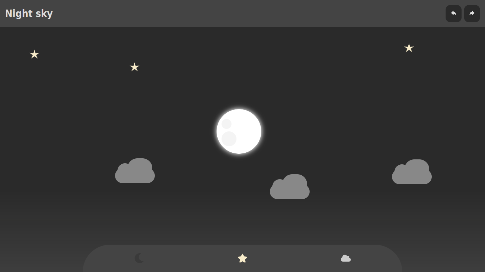
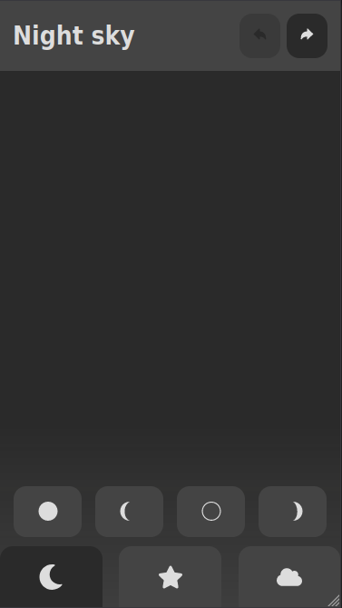
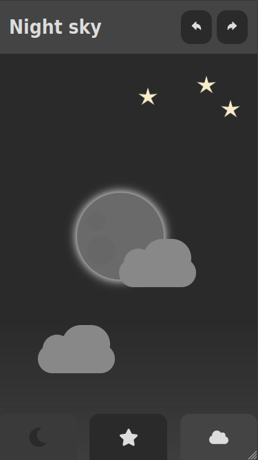

# :full_moon: Night sky

O projeto apresenta uma aplicação de desenho de um céu noturno utilizando React com Context API para o gerenciamento de estados.

O usuário pode escolher a figura que deseja desenhar selecionando o seu tipo (lua, estrela ou nuvem) na parte inferior da tela. Então, a cada clique na tela é inserido um novo desenho na posição exata do clique. Também é possível desfazer e refazer desenhos a partir dos respectivos botões na parte superior da tela. A aplicação permite a existência de apenas uma lua na área de desenho.

## :gear: Tecnologias

- HTML
- CSS
- JavaScript
- React
- React Icons
- React Context API

## :art: Layout

